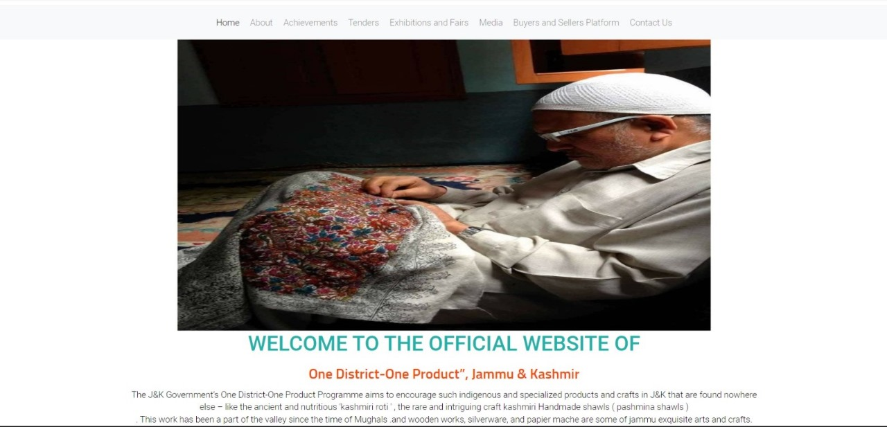
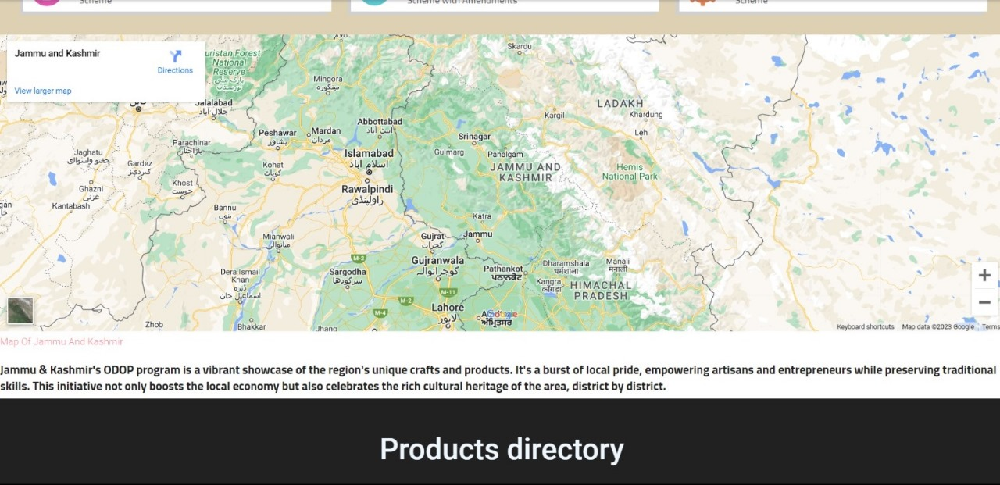
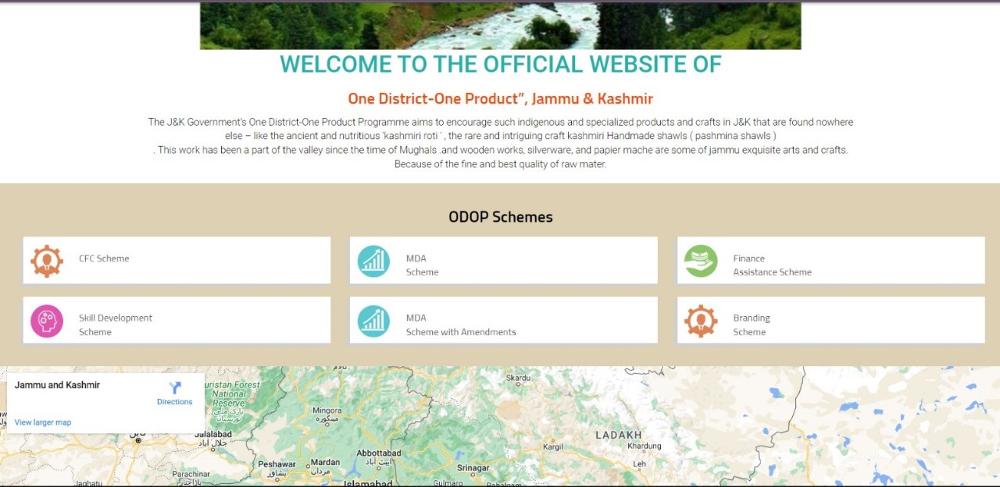
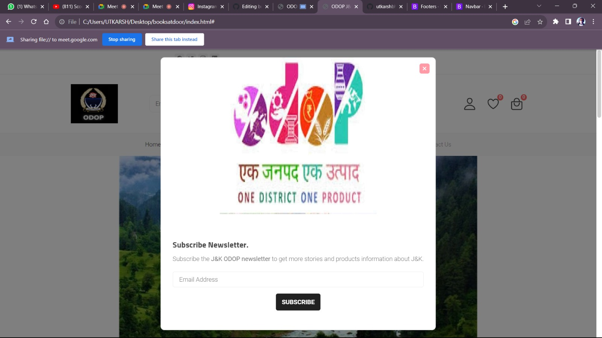

README
Team Bazinga, Galgotias University

Smart India Hackathon

Welcome to the GitHub repository of Team Bazinga, Galgotias University for the Smart India Hackathon! We are a team of passionate students working on innovative solutions to real-world problems.

Problem Statement

The problem statement that we are working on for the Smart India Hackathon is:

Developing solutions to effective market linkage and promotion of One District One Product.

Solution

We’re here for a solution by creating an android and web-based portals that will serve as a platform for local artisan , vendors and craftsmen to showcase their rich cultures and traditions under the scheme of ODOP , to promote local startups and boost rural and  small-scale industries

Implementation

Buyers can leave reviews and feedback; this feedback loop helps artisans improve their products and build trust with consumers.
Government officials have access to real-time data on the platform, enabling them to monitor the progress of the ODOP scheme effectively.

We are using a variety of technologies to implement our solution, including:
HTML, bootstrap css, Javascript: basic webdevelopment languages.
blockchain:
Google Maps API: To track the location of district in real time.
Firebase: To store and manage user data and vehicle data.

Progress

We have made significant progress on our solution so far. We have developed a prototype of the web application, and we are currently testing it. 
Thank you for your interest in Team Bazinga's Smart India Hackathon project

